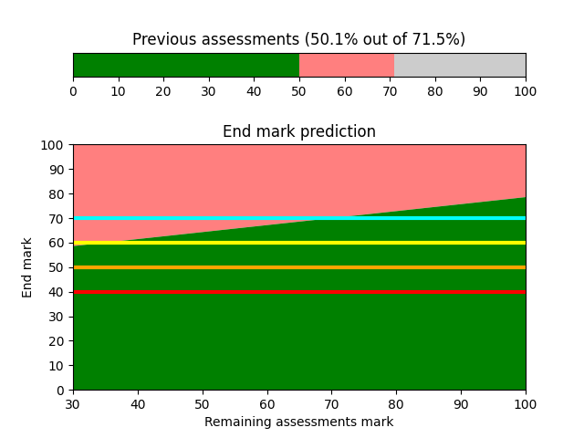
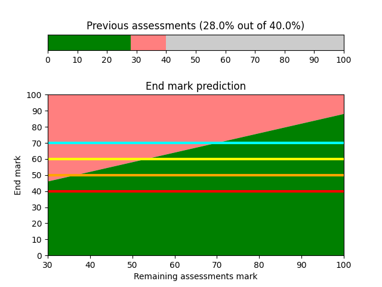
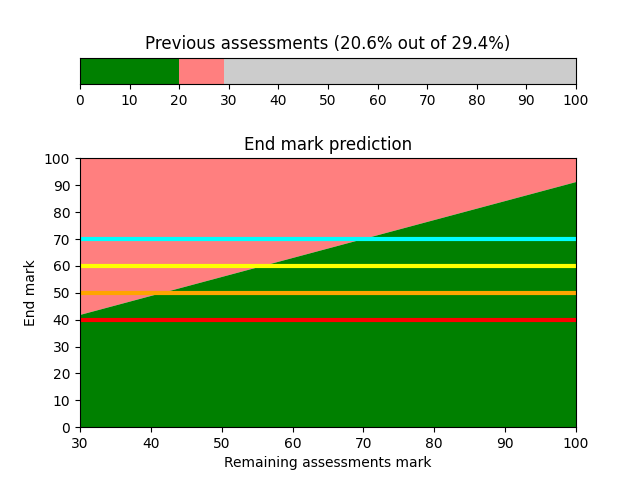

# marks.py  
Marks calculator. Basing on previous marks it calculates what mark you need to get in remaining assessments in order to get desired end mark.  

It can be used to calculate:  
* module mark  
* year mark  
* whole degree mark  

# Example program output  

  

# How to use it
Supply marks achieved for past assessments by modifying `previous_marks` list in the [marks.py](./marks.py), and then run it with python. See [Usage examples](usage-examples) section.  

# Prerequisites
Python 3.7 (or later) with the following libraries:  
* matplotlib  
* numpy  
* tkinter  

These libraries can be installed by executing the following command:  
`python3 -m pip install matplotlib numpy tk`  

# Usage examples
3 examples below show how to modify the `previous_marks` list/section of the [marks.py](./marks.py) code. All examples assume that the student achieved 70% from every assessment.  

### Calculating module mark
In example below it is assumed that the student completed 2 assessments so far, each being worth 20% of the whole module.  

```python
previous_marks = [
    # Format: (mark, weight)

    (70, 20), 
    (70, 20)
    ]
```

This example would result in the following output:  
  

### Calculating year mark
In example below it is assumed that the student has 8 modules.  

```python
M_WEIGHT = 100 / 8   # weight of a single module
previous_marks = [
    # Format: (mark, weight)

    # finished modules marks
    (70, M_WEIGHT),
    (70, M_WEIGHT),

    # unfinished modules marks
    (70, M_WEIGHT * 0.2),
    (70, M_WEIGHT * 0.15)
    ]
```

This example would result in the following output:  
  


### Calculating whole degree mark
In example below it is assumed that second year of a degree was worth 40%, 3rd year was worth 60% and that there were 8 modules in the 3rd year.  

```python
SECOND_YEAR_WEIGHT = 40
M_WEIGHT = 60 / 8           # single module weight (in 3rd year)

previous_marks = [
    # Format: (mark, weight)

    # 2nd year overall mark
    (70,   SECOND_YEAR_WEIGHT), 

    # total module marks
    (70,   M_WEIGHT),          # Some module final mark
    (70,   M_WEIGHT),          # Another module final mark
    (70,   M_WEIGHT),          # And another module final mark

    # module marks with some assessments unmarked yet
    (70,  M_WEIGHT * 0.06),     # This assessment was worth 6% of some module.
    (70,  M_WEIGHT * 0.12),     # This assessment was worth 12% of some module.
    (70,  M_WEIGHT * 0.12),     # This assessment was worth 12% of some module.
    (70,  M_WEIGHT * 0.1),      # This assessment was worth 10% of some module.
    (70,  M_WEIGHT * 0.2),      # This assessment was worth 20% of some module.
    ] 
```

This example would result in the following output:  
  


